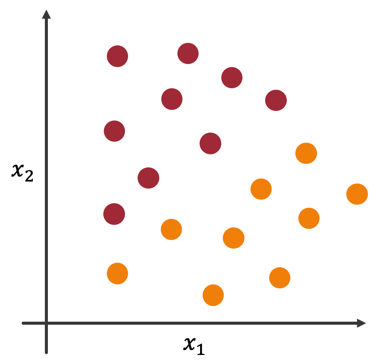
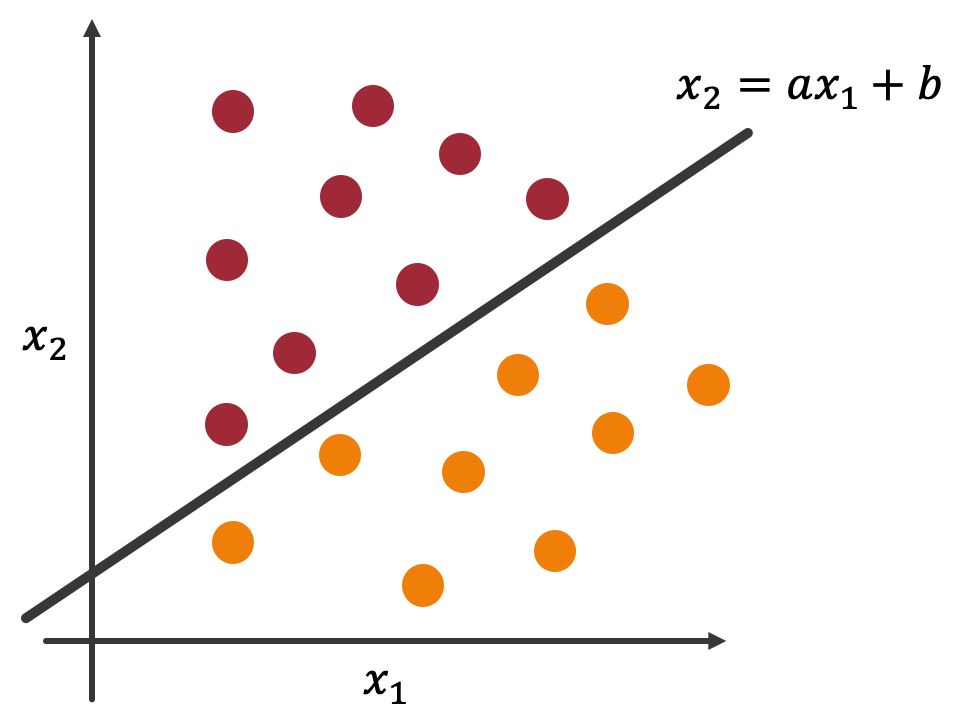

===============================================
機械学習による分類
===============================================

　前々章では，テキストデータに対して前処理を施しました．前章ではテキストデータを機械学習で扱えるようにベクトルに変換しました．本章ではいよいよ機械学習を用いてテキストを分類していきます．今回は機械学習モデルの一つである **ロジスティック回帰** を用いてテキスト分類を行なっていきます．「回帰」という単語が含まれていますが，分類のためのモデルであることに注意してください．

.. note:: 

    　本レクチャーは2020年度菊池研究室新歓合宿のB3向けレクチャーのうちの一つです．同じ年の他のレクチャーで機械学習に関するものがあるため，本レクチャーで機械学習に関する詳しい説明は行いません．

.. contents:: 目次

ロジスティック回帰
===============================================

　本節では，ロジスティック回帰がどのようなモデルなのかについて説明します．繰り返しになりますが，ロジスティック回帰は分類のためのモデルです．よってここでは簡単な2値分類の問題を例としてとりあげましょう．

　りんごとみかんを分類する問題を考えます．各軸は果物の色と大きさを表すものとします．便宜上， :math:`x_1` を色，:math:`x_2` を大きさとしておきます．このような設定でデータを描画したのが以下のグラフです．（赤い点がりんご，オレンジの点がみかんです．）

　分類問題は線を引いて空間を切る問題と考えることができます．その際の切り方には色々と考えられますが，ここでは直線で切ることにします．その直線を :math:`x_2=ax_1+b` としましょう．

　直線 :math:`x_2=ax_1+b` で空間を切ることで2つの領域ができました．各領域はりんごとみかんの領域であり，数式を使って表すことができます．直線より上の領域は  :math:`x_2≧ax_1+b` ，下の領域は :math:`x_2<ax_1+b` で表すことができます．

　このような直線を求めることができれば，新しい未知な :math:`(x_{1_i}, x_{2_i})` に対して分類を予測できるようになりますね．

　以上の話を定式化しましょう．そのために，りんごを1，みかんに0を割り当てておきます．分類結果を :math:`y` とすると，分類は以下のように定式化できます．

.. math::

    y=\left\{
        \begin{array}{}
            1 & (x_2-ax_1-b≧0)\\
            0 & (x_2-ax_1-b<0)
        \end{array}
    \right.

　右辺の項を左辺に移行していることに注意してください．

.. note:: 

    今回は変数が2つの場合を考えました．扱う特徴量にもよりますが，BoWの場合はこの変数 :math:`x` がVocaburaryの数だけ存在することになります．

.. note:: 

    ロジスティック回帰の説明はここまでにしておきます．分類するための直線をどのように得るのか，などについては以下の資料等を参考にしてください．ここでは，ロジスティック回帰とは線形に分類するモデルである，ということだけを知っておいてください．

    - 中山光樹，『機械学習・深層学習による自然言語処理入門 scikit-learnとTensorFlowを使った実践プログラミング』，マイナビ出版

　以下のリンクにソースコードを用意しています．これまでの知識を利用して実際のテキスト分類タスクに取り組んでみましょう．

`machine_learning.ipynb <https://colab.research.google.com/drive/1okOEiSNm3lGSMQk3kYieuWexUvXDkzPZ?usp=sharing>`_